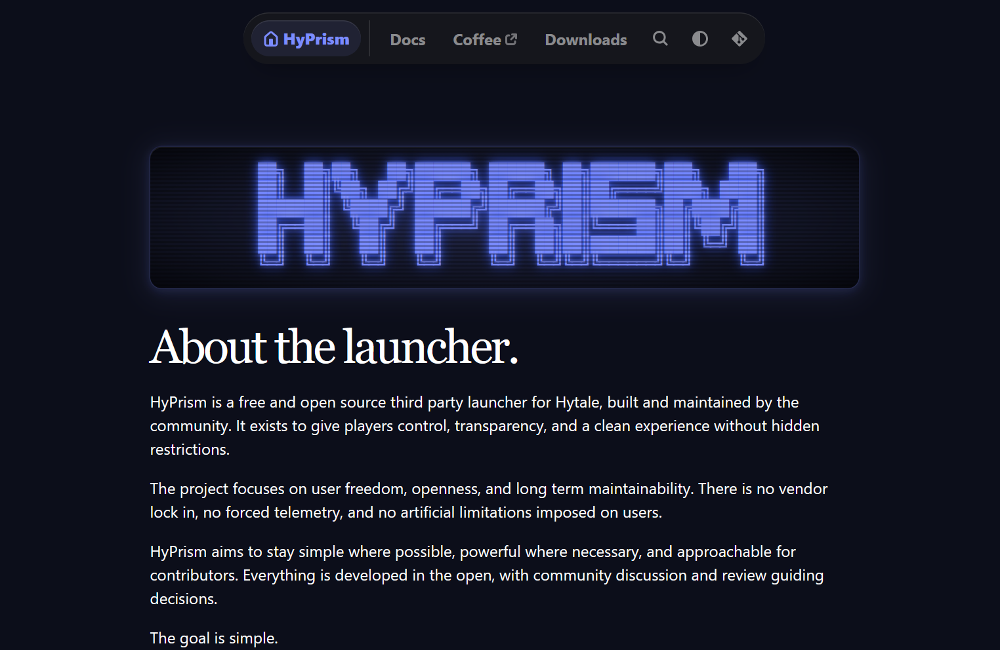

# HyPrism Website

> Official website and documentation for **HyPrism**,
> a free and open source third-party launcher for **Hytale**.

## Overview

This repository contains the **HyPrism website**, built with **Zola** and the **Duckquill** theme.

It serves three purposes:

- A public landing page for HyPrism
- A structured documentation site
- A release and download hub backed by GitHub Releases

The design favors clarity, contrast, and composability over visual noise.

---

## Features

### Website

- Static site built with **Zola**
- Duckquill theme with minimal overrides
- Self-hosted fonts and assets
- Fully responsive layout
- Dark-first design with system theme support
- Accessible navigation and keyboard support

### Downloads

- Centralized downloads via GitHub Releases
- Platform-specific sections for Windows, macOS, and Linux
- No custom backend or tracking scripts
- Transparent and verifiable binaries

### Documentation

- Markdown-first content
- Section-based docs layout
- Clean internal linking
- Automatic navigation and search
- No JavaScript-heavy UI layers

---

## Tech Stack

| Layer | Technology |
|------|------------|
| Static Site | Zola |
| Theme | Duckquill |
| Styling | Sass |
| Hosting | GitHub Pages / Vercel |
| Assets | Self-hosted |
| CI | GitHub Actions |
